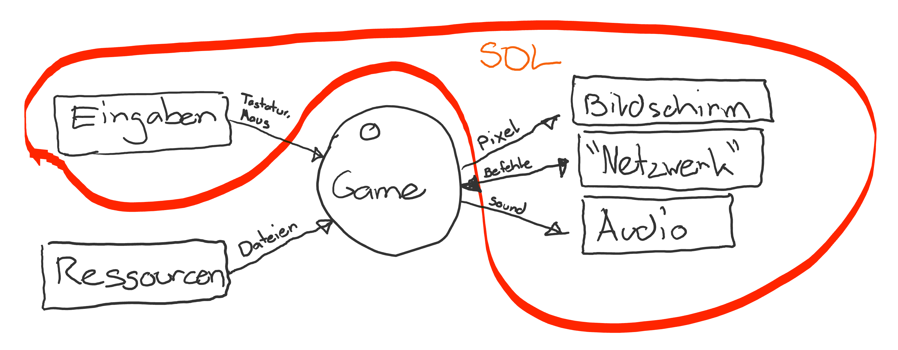
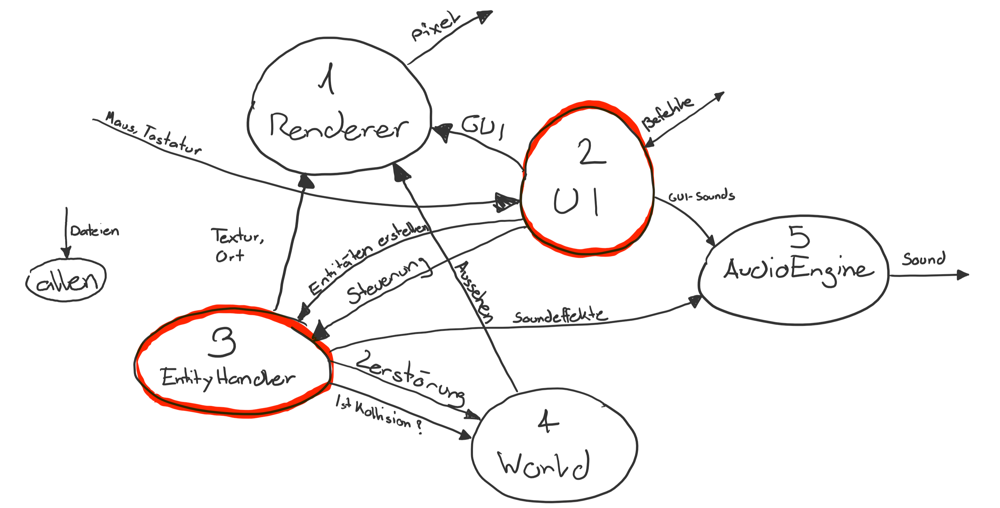
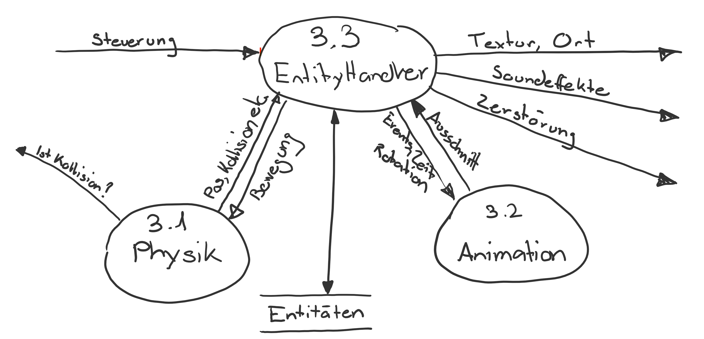

# DFD - Data Flow Diagram

Dieses DFD beschreibt die Quellen und Senken von Daten, Datenflüsse sowie die datenverarbeitenden Module.
Dies entspricht nicht dem Kontrollfluss, dieser ist in [Programmfluss](./../Programmfluss.md) beschrieben.

## Kontext

@image latex Kontext.png Kontext

## Level 0

@image latex 0.png Level 0

## UI

@image latex 2-UI.png 2-UI

## EntityHandler

@image latex 3-EntityHandler.png 3-EntityHandler

