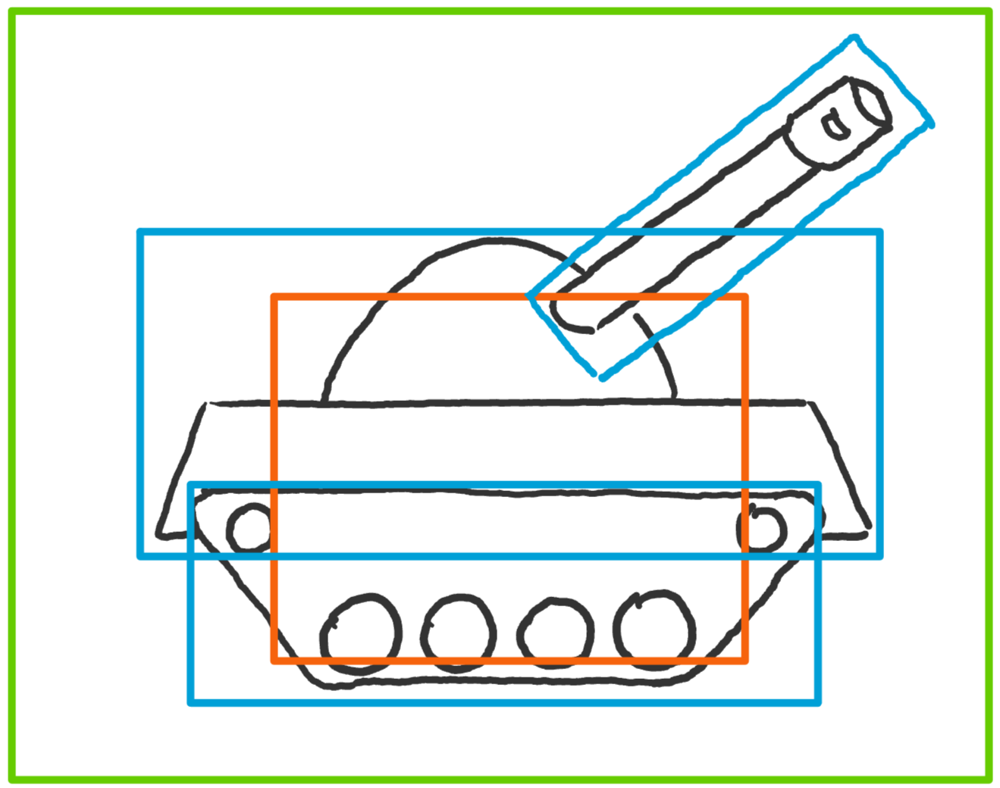

# Entität {#Entitaet}

Abgesehen von der Bedienoberfläche und der Spielwelt sind alle anderen Spielobjekte als sogenannte Entitäten aufgebaut.
Diese Entitäten sind abstrakte Objekt welche *existieren*. Auf diese Entitäten wirkt dann die Physik der Spielwelt: Sie können auf der 2D-Welt *stehen* und mit anderen Entitäten zusammenstossen. Jede Entität selber ist dann weiter aufgebaut aus verschiedenen Einzelteilen.

## Aufbau

@image latex EntitaetAufbau.png Aufbau einer Entität

Grün - Die gesamte Entität.
- Panzer

Blau - Einzelteile aus dessen die Entität aufgebaut ist.
- Panzerrohr
- Fahrkabine
- Chassis
- Raupen

Orange - Kollisionsbox welches die Entität physikalisch repräsentiert.

### Einzelteile

Eine Entität sollte aus mindestens einem Einzelteil bestehen. Es gibt keine maximale Anzahl an Teilen. Vorteil der Unterteilung in Einzelteile sind:
- Teile lassen sich unabhängig voneinander Animieren (mittels `Sprite-Modul`)
- Teile können einfach ausgetauscht oder erweitert werden. So könnte z.B. ein Panzer seine Waffe tauschen oder eine Sekundärwaffe erhalten.

### Kollisionsbox

Um die physikalischen Interaktionen simpel zu halten, definiert jede Entität eine Kollisionsbox. Kommt eine Kollisionsbox einer anderen Entität in Kontakt mit der eigenen wird dies als Kollision der Entität gemeldet. Diese kann dann entsprechend reagieren. Ebenfalls wird durch diese Box *auf* der Oberfläche der 2D-Welt *gestanden*.

## Interaktivität

Um interaktive Entitäten zu gestalten, kann das Callback-System verwendet werden. Jede Entität kann folgende Callbacks definieren:
- `onUpdate` 
- `onCollision`
- `onDraw`

Die Reihenfolge des Aufrufs ist `onUpdate` -> `onDraw` und wird dann zyklisch wiederholt. Die Kollisionen werden während der Update-Phase detektiert und dadurch wird `onCollision` in dieser Phase aufgerufen. Definiert eine Entität nicht alle oder keine Callbacks, werden die Standard-Callbacks des EntityHandler verwendet. Diese Standards sind: `onUpdate` -> mache gar nichts, `onCollision` -> das Physics-Modul sorgt dafür dass Entitäten nicht in der Welt versinken, `onDraw` -> zeichne alle Entitätsteile in Reihenfolge der internen Liste (zuletzt hinzugefügte Teile werden zuerst gezeichnet, werden also ev. von anderen überdeckt).

### onUpdate

Hier kann die Logik der Entität implementiert werden. Sie darf sich selber verändern, sich bewegen, andere Entitäten hinzufügen, Soundeffekte abspielen und vieles weiteres.
Als Argument des Callbacks wird unter anderem eine Struktur der letzten Systemeingaben bez. Steuerbefehle übergeben.

### onCollision

Hier kann die Entität auf Kollisionen reagieren. Wenn sie z.B. ein Panzer ist, der von einem Geschoss getroffen wurde, kann sie sich hier Lebenspunkte abziehen.

### onDraw

Muss eine Entität, aufwendiger als es die Standard-Zeichnen Funktion des EntityHandlers implementiert, gezeichnet werden, kann dies hier erfolgen. Von hier sind Aufrufe zum `SDLWrapper-Modul` zulässig. Allerdings muss das gesamte Zeichnen übernommen werden, denn mit definiertem Callback wird die Standard-Zeichnen Funktion nicht mehr verwendet.

## Bewegung

Bewegungen einer Entität werden durch das `Physics-Modul` verwaltet. Es stellt diverse Funktionen zur Verfügung wie z.B. `Physics_SetVelocity()` durch die eine Bewegung eingeleitet werden kann.
