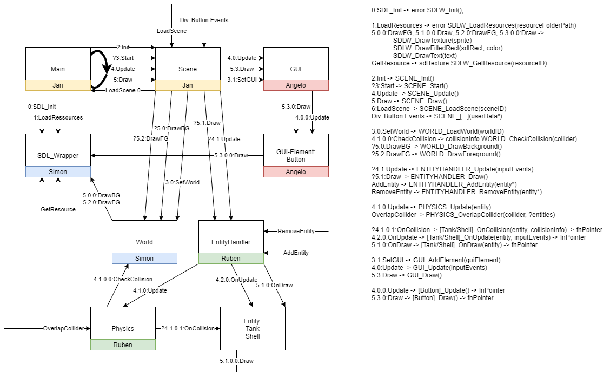

# Programmfluss

Folgenes Diagramm beschreibt den allgemeinen Kontrollfluss. Pfade mit einem Fragezeichen werden nur bedingt in jedem Zyklus aufgerufen. Anhand der Nummerierung kann die sequenzielle Abfolge verfolgt werden, z.B.: `4 -> 4.0 -> 4.0.0 -> 4.1 -> 4.1.0 -> 4.1.0.1` usw.

@image latex InterfaceDiagram.png Programmfluss
