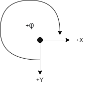
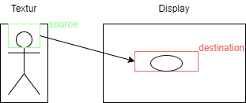
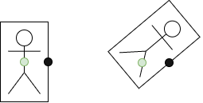
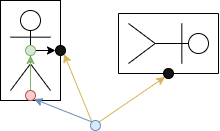
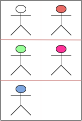

# Sprite {#Sprite}

Ein Sprite ist eine Struktur, welche zusätzliche Informationen zur Positionierung, Skalierung und Rotation enthält.

## Koordinaten
Das Koordinatensystem sieht wie folgt aus.

@image latex SpriteKoor.png Koordinatensystem

Die Positionen werden relativ zu der Position .position des Sprites gezeichnet.
Dies hat der Vorteil, dass wenn man mehrere Sprites vom selben Objekt hat, muss man bei allen nur die Position anpassen, die Offsets bleiben gleich.

Die Position des Sprites bezieht sich auf das Zentrum.

## Source/Destination
Mithilfe des source-Rechtecks (grün) gibt man an, welcher Teil der Textur gezeichnet werden soll.
Dies wird benötigt, falls nicht die ganze Textur angezeigt werden soll. Siehe MultiSprite.

Mithilfe des destination-Rechtecks (rot) gibt man an, wohin mit dem source-Rechteck Bereich gezeichnet werden soll.
Sind die source- und destination-Rechtecke nicht gleich gross, wird der Bereich skaliert und verzerrt.

@image latex SpriteIntro.png Sprite Source/Destination

## Pivot/Rotation
Wird das Sprite rotiert, erfolgt die Rotation um seinen Pivot. Dieser ist relativ zur Position+Offset des Sprites.

Wie unten ersichtlich wurde die Textur um einen Pivot (schwarz) gedreht.
Dadurch ist die Position (grün) nicht mehr im Zentrum des Sprites.

@image latex SpritePivot.png Sprite Rotation

## Rotation Relativ zu Pivot
Um eine zusätzliche Rotation um ein Gesamtobjekt zu ermöglichen existiert die Funktion Sprite_SetRelativeToPivot.

Diese Funktion setzt die Position(rot) des angegebenen Sprites so, dass dieser Pivot(schwarz) um den externen Pivot(blau) rotiert.
Der Offset(grün) und die eigene Rotation wird nicht verändert.

@image latex SpriteExternPivot.png Sprite externe Rotation

## Multisprite
Der Multisprite teilt eine Textur in mehrere Stücke auf, welche einzeln mithilfe von Hilfsfunktionen angezeigt werden.

Die Textur wird in Anzahl Stücke in X- und Y-Richtung aufgeteilt. Im Beispiel unten X=2, Y=3. Zudem muss die Anzahl angegeben werden, da die Textur nicht voll mit Stücken gefüllt werden muss.

@image latex SpriteAtlas.png Sprite Atlas

