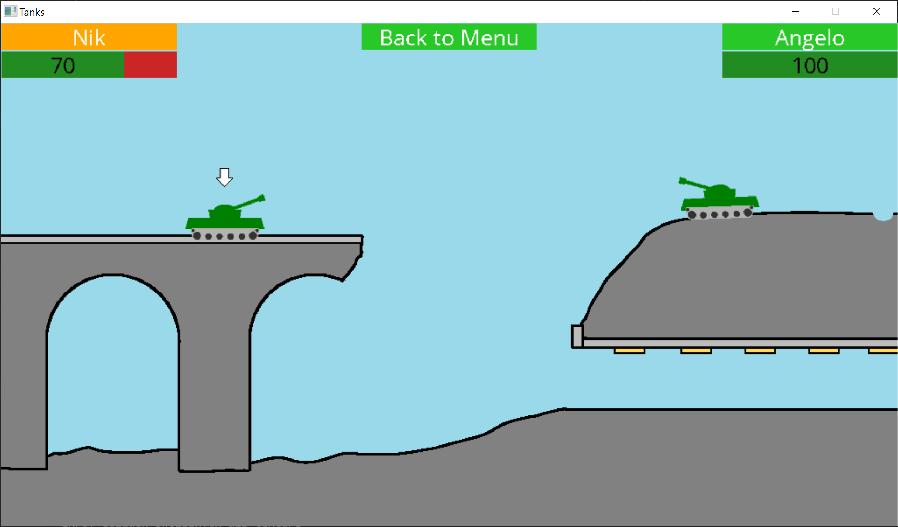

# Spielaufbau Tanks

## Genereller Ablauf
Über die GUI lässt sich eine der zwei verfügbaren Welten (Evergreen oder Aquaduct) auswählen. Auf ihr werden dann zwei Panzer platziert. Diese Panzer reagieren (wenn der entsprechende Spieler am Zug ist) auf die WASD-Tasten sowie auf die Leertaste. Mit WASD wird der Panzer und das Schussrohr bewegt sowie mit der Leertaste ein Schuss abgefeuert. Bei jedem Schuss wechselt die Kontrolle zum anderen Spieler. Da das Spiel nur lokal spielbar ist, muss an diesem Punkt die Tastatur dem Mitspieler übergeben werden. Der jeweils aktive Spieler ist in den Oberen Ecken des Spielfensters orange markiert. Jeder Treffer zieht Lebenspunkte ab. Diese werden direkt unterhalb des Spielernamens angezeigt. Gewonnen hat, wer den Panzer des Gegners komplett zerstört hat.

@image latex SpielAufbau.png Programmfluss

# Technischer Ablauf
Das Spiel ist aus den implementierten Modulen: SDLW, Sprite, Gui und EntityHandler aufgebaut. Diese drei Module werden vom Scene-Modul zusammen verknüpft und in der benötigten Abfolge (siehe [Fluss](Programmfluss.md)) aufgerufen.

Damit das Spiel aus technischer Sicht funktioniert, müssen diese verschiedenen Module effizient miteinander kommunizieren. Dazu wurde ein [Event-System](@ref inputEvent_t) implementiert. Bei jedem Updatezyklus des Spiels wird diese Event-Struktur von der Szene gefüllt und an die einzelnen Module weitergereicht. So werden z.B. Mausklicks und Tastatureingaben den Modulen bekannt gemacht.

In dieser Struktur ist auch eine weitere Struktur eingebettet, die [Player-Struktur](@ref player_t). Durch diese können die verschiedenen Entitäten miteinander kommunizieren. Wenn z.B. ein Schuss mit einem Panzer kollidiert, so zieht er dem entsprechenden Spieler Lebenspunkte ab. Auf diese Struktur hat auch die Szene zugriff und aktualisiert damit z.B. die Anzeigen der Lebenspunkte.Ebenfalls ist für jeden Spieler ein [Spielzugschritt](@ref playerStep_t) gespeichert. Hierüber sind die verschiedenen Zustände eines Spielzuges definiert:
- Zu beginn jedes Zugs setzt die Szene den Schritt auf [Start](@ref PLAYER_STEP_START).
- In der Panzer Entität die am Zug ist, wird daraufhin auf den Schritt [Move](@ref PLAYER_STEP_MOVE) gewechselt. In diesem Schritt kann der Panzer nun per WASD-Tasten gesteuert werden.
- Sobald die Leertaste gedrückt wurde, wird vom Panzer in den Schritt [Velocity](@ref PLAYER_STEP_VELOCITY) gewechselt. Nun wird ein Indikator der Abschussgeschwindigkeit angezeigt.
- Sobald die Leertaste erneut gedrückt wurde, wechselt der Panzer in den weiteren Schritt [Fire](@ref PLAYER_STEP_FIRE). Er erstellt eine Schuss-Entität und schiesst diese in die Richtung in die sein Schussrohr zeig ab.
- Die Panzer-Entität ist nun fertig mit seinen Aktivitäten. Ab hier übernimmt die Schuss-Entität die Spiellogik. Der Schuss fliegt solange in einer gewöhnlichen Wurfparabel bis es eine andere Entität oder die Welt trifft.
- Egal welche Kollision, der Schuss setzt danach den Schritt auf [Done](@ref PLAYER_STEP_DONE). Hiermit weiss die Szene, dass der Spielzug beendet ist. Kollidierte der Schuss mit einem gegnerischen Panzer, so zieht sich der Panzer noch Lebenspunkte ab.
- Die Szene wechselt nun den aktiven Spieler und die Schritte werden erneut durchlaufen.

Die gesamte Spiellogik ist somit verteilt auf die Szene und die einzelnen Entitäten.

## Zusätze
Zusätzlich zum Grundspiel sind folgende Zusätze gemäss [Pflichtenheft](Pflichtenheft.md) umgesetzt:
- Zerstörbares Terrain
